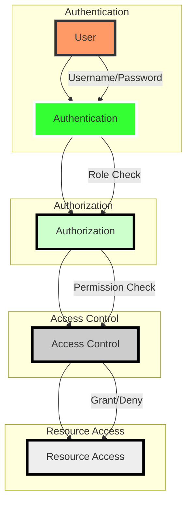

# Broken Access Control

# Broken Access Control: Understanding and Mitigating Unauthorized Actions

## Introduction

In today’s digital landscape, ensuring that only authorized users can access specific resources is crucial for maintaining the integrity and confidentiality of your data. Access control mechanisms are designed to enforce policies that restrict user actions based on predefined roles and permissions. However, even with robust access control systems in place, vulnerabilities can still arise, leading to serious security breaches. In this blog post, we will explore what broken access control means, why it happens, and how you can mitigate these risks.

## What is Broken Access Control?

Broken access control refers to situations where the mechanisms designed to restrict user actions fail to do so effectively. This failure can manifest in various ways, such as allowing unauthorized users to view sensitive data, modify critical information, or even destroy important files. Essentially, any scenario where a user can perform actions beyond their intended permissions falls under the umbrella of broken access control.

### Common Causes of Broken Access Control

Several factors contribute to broken access control:

- **Insufficient Authentication**: Weak or missing authentication mechanisms can allow unauthorized users to bypass access controls.
- **Improper Authorization**: Incorrectly configured authorization rules can grant excessive permissions to users.
- **Session Management Issues**: Poor session management practices can lead to session hijacking, enabling unauthorized access.
- **Insecure Direct Object References**: Direct object references without proper validation can expose sensitive data.
- **Permissions and Privileges Mismanagement**: Incorrect assignment of permissions and privileges can lead to unauthorized access.

### Real-world Implications

When access control fails, the consequences can be severe. Unauthorized access can lead to data breaches, financial loss, and damage to reputation. For instance, if an attacker gains access to sensitive customer data due to broken access control, it could result in legal liabilities and loss of customer trust.

## How to Mitigate Broken Access Control Risks

To protect against broken access control, consider implementing the following best practices:

- **Implement Strong Authentication Mechanisms**: Use multi-factor authentication (MFA) to ensure that only verified users can access protected resources.
- **Enforce Least Privilege Principle**: Grant users only the minimum permissions necessary to perform their tasks. This reduces the risk of unauthorized access.
- **Regularly Audit and Update Access Controls**: Conduct regular audits to identify and correct any misconfigurations in access control settings.
- **Use Secure Session Management Practices**: Implement secure session management techniques to prevent session hijacking and other related attacks.
- **Validate Direct Object References**: Ensure that direct object references are properly validated before granting access to sensitive data.

## Conclusion

Broken access control remains one of the most significant threats to web application security. By understanding the causes and implementing effective mitigation strategies, organizations can significantly reduce the risk of unauthorized access and data breaches. Remember, strong access control is not just about preventing attacks but also about maintaining the integrity and confidentiality of your data.

Stay vigilant and proactive in securing your applications against broken access control vulnerabilities.

## Demo & Implementation Ideas

주제인 "Broken Access Control"에 대한 블로그 포스트에서 독자가 더 잘 이해할 수 있도록 다음과 같은 추가 요소들을 제안합니다:

### 1. 실습 코드 스니펫 (Python)

실제 웹 애플리케이션에서 발생할 수 있는 Broken Access Control 문제를 시뮬레이트하는 Python 코드 스니펫을 제공하면 좋겠습니다. 이를 통해 독자는 실제 상황에서 어떻게 이런 문제가 발생하고 해결될 수 있는지 이해할 수 있습니다.

#### 예시 코드:

```python
# Simulating a simple web application with broken access control
class User:
    def __init__(self, username, role):
        self.username = username
        self.role = role

    def has_permission(self, permission):
        # Simple check for demonstration purposes
        return True if permission == 'admin' and self.role == 'admin' else False

def get_user_data(user):
    if user.has_permission('admin'):
        print("Admin data accessed")
    else:
        print("Access denied")

# Simulated users
user1 = User('alice', 'user')
user2 = User('bob', 'admin')

# Attempting to access admin data
get_user_data(user1)  # Expected output: Access denied
get_user_data(user2)  # Expected output: Admin data accessed

# Simulating broken access control
user1.role = 'admin'  # Simulating a broken access control mechanism
get_user_data(user1)  # Expected output: Admin data accessed (should be denied)
```

위 코드는 사용자 권한 체크 메커니즘이 제대로 작동하지 않는 경우를 보여줍니다. 이를 통해 독자는 Broken Access Control의 원인과 결과를 이해할 수 있습니다.

### 2. Mermaid 다이어그램 코드

Mermaid 다이어그램을 사용하여 Broken Access Control의 개념을 시각화할 수 있습니다. 이를 통해 독자는 복잡한 개념을 쉽게 이해할 수 있습니다.

#### 예시 코드:



위 Mermaid 다이어그램은 사용자가 리소스에 접근하기 위해 거쳐야 하는 인증, 권한 확인, 접근 제어 등의 과정을 보여줍니다. 이를 통해 Broken Access Control이 발생하는 위치와 이유를 명확히 이해할 수 있습니다.

### 3. Docker Compose 설정

웹 애플리케이션을 실행하고 Broken Access Control 문제를 시뮬레이트하기 위한 Docker Compose 파일을 제공하면 좋습니다. 이를 통해 독자는 실제 환경에서 어떻게 이런 문제가 발생하고 해결될 수 있는지 직접 경험해볼 수 있습니다.

#### 예시 코드:

```yaml
version: '3'
services:
  webapp:
    image: my_web_app_image
    ports:
      - "8000:80"
    environment:
      - DEBUG=True
      - SECRET_KEY=mysecretkey
    volumes:
      - ./webapp:/app
```

위 Docker Compose 파일은 웹 애플리케이션을 실행하기 위한 기본 설정을 제공합니다. 이를 통해 독자는 실제 웹 애플리케이션 환경에서 Broken Access Control 문제를 시뮬레이트하고 해결 방법을 적용해볼 수 있습니다.

이러한 추가 요소들을 포함하면 독자는 Broken Access Control 문제에 대해 더 깊게 이해하고, 실제 상황에서 어떻게 이러한 문제를 해결할 수 있는지 직접 경험해볼 수 있을 것입니다.