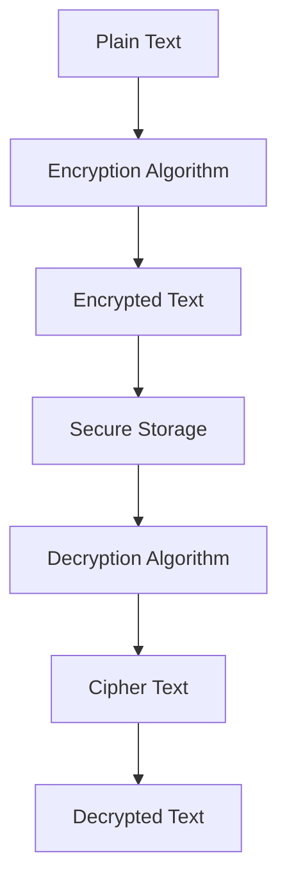

# Cryptographic Failures

# Cryptographic Failures: Understanding the Risks

## Introduction

In today’s digital landscape, security is paramount. One critical aspect of securing your systems is ensuring that your cryptographic mechanisms are robust and free from vulnerabilities. Cryptography plays a crucial role in protecting sensitive data and maintaining the integrity of your systems. However, even with strong encryption methods, there are still common pitfalls that can lead to significant security breaches. In this blog post, we will explore the concept of cryptographic failures, focusing on how these failures can expose sensitive data or compromise your systems.

## Main Content

### What Are Cryptographic Failures?

Cryptographic failures refer to any weaknesses or errors in the implementation or usage of cryptographic algorithms and protocols. These failures can manifest in various ways, including but not limited to:

- **Weak Encryption Algorithms**: Using outdated or weak encryption algorithms that can be easily broken.
- **Poor Key Management**: Failing to properly manage encryption keys, leading to key leakage or theft.
- **Misconfigured Security Settings**: Incorrectly configuring security settings, such as SSL/TLS certificates, which can leave your system vulnerable.
- **Insufficient Randomness**: Generating predictable random numbers, making it easier for attackers to guess encryption keys.
- **Lack of Proper Validation**: Failing to validate cryptographic inputs, allowing attackers to exploit vulnerabilities through crafted inputs.

### Real-World Implications

Cryptographic failures can have severe consequences, ranging from data breaches to complete system compromise. Here are some real-world implications of cryptographic failures:

- **Data Exposure**: Sensitive data, such as personal information, financial records, and intellectual property, can be exposed to unauthorized parties.
- **System Compromise**: Attackers can exploit cryptographic weaknesses to gain unauthorized access to systems, potentially leading to further attacks or data manipulation.
- **Reputation Damage**: Companies that suffer from cryptographic failures may face significant reputational damage, losing customer trust and potentially facing legal repercussions.

### Mitigating Cryptographic Failures

To mitigate the risks associated with cryptographic failures, organizations should adopt best practices and continuously monitor their cryptographic implementations. Some effective strategies include:

- **Regular Audits**: Conducting regular audits and assessments of cryptographic systems to identify and address potential vulnerabilities.
- **Strong Key Management**: Implementing robust key management policies, including secure key generation, storage, and distribution.
- **Up-to-Date Algorithms**: Utilizing modern and well-reviewed cryptographic algorithms and protocols to ensure security against known threats.
- **Employee Training**: Educating employees about the importance of cryptographic security and providing training on best practices for handling sensitive data.

## Conclusion

Cryptographic failures pose a significant risk to the security of your systems and data. By understanding the common causes and real-world implications of these failures, you can take proactive steps to protect your organization. Regular audits, strong key management, and employee training are essential components of a comprehensive cryptographic security strategy. Remember, the strength of your cryptographic defenses is only as good as the weakest link in your system. Stay vigilant and prioritize security to safeguard your sensitive data and maintain the integrity of your systems.

---

This blog post aims to provide a clear and concise overview of cryptographic failures, emphasizing the importance of robust cryptographic practices in today’s digital environment.

## Demo & Implementation Ideas

주제인 "Cryptographic Failures"에 대한 블로그 포스트에서 독자가 더 잘 이해할 수 있도록 다음과 같은 추가 내용을 제안합니다:

### 1. 실습 가능한 코드 스니펫 (Python)

#### 암호화 및 복호화 예시
Python을 사용하여 AES (Advanced Encryption Standard) 알고리즘을 이용한 간단한 암호화와 복호화를 수행하는 코드를 제공하면 독자는 실제 암호화 과정을 보다 쉽게 이해할 수 있습니다.

```python
from Crypto.Cipher import AES
import base64

# 키 생성 (실제 사용 시에는 안전하게 관리해야 함)
key = b'sixteen byte key'
cipher = AES.new(key, AES.MODE_EAX)

# 암호화할 데이터
data = b'Hello, World!'

# 암호화
ciphertext, tag = cipher.encrypt_and_digest(data)

# 암호화된 데이터 출력
print("Ciphertext:", base64.b64encode(ciphertext))

# 복호화
decipher = AES.new(key, AES.MODE_EAX, nonce=cipher.nonce)
plaintext = decipher.decrypt(ciphertext)

# 원본 데이터 확인
print("Decrypted text:", plaintext.decode())
```

위 코드는 Python의 `pycryptodome` 라이브러리를 사용하여 AES 알고리즘을 적용한 예시입니다. 이를 통해 독자는 암호화와 복호화 과정을 직접 경험하며, 암호화 알고리즘의 중요성을 이해할 수 있습니다.

### 2. Mermaid 다이어그램 코드

#### 암호화 프로세스 다이어그램
암호화 프로세스를 시각적으로 표현하기 위해 Mermaid 다이어그램을 사용할 수 있습니다. 아래는 암호화 프로세스를 설명하는 간단한 다이어그램 코드입니다.



이 다이어그램은 암호화 과정에서 발생하는 주요 단계를 시각적으로 보여줍니다. 이를 통해 독자는 암호화 프로세스의 전체적인 흐름을 이해하고, 각 단계에서 발생할 수 있는 취약점을 파악할 수 있습니다.

### 3. Docker Compose 설정

#### 암호화 실험 환경 구성
독자가 암호화 실험 환경을 쉽게 구성할 수 있도록 Docker Compose 파일을 제공할 수 있습니다. 아래는 간단한 암호화 서버와 클라이언트를 포함하는 Docker Compose 설정 예시입니다.

```yaml
version: '3'
services:
  server:
    image: python:3.8-slim
    command: python -m http.server 8000
    volumes:
      - ./server:/code
    ports:
      - "8000:8000"
  client:
    image: python:3.8-slim
    command: python client.py
    volumes:
      - ./client:/code
    depends_on:
      - server
```

위 설정은 Python 기반의 간단한 HTTP 서버와 클라이언트를 Docker 컨테이너로 실행하도록 합니다. 이를 통해 독자는 실제 암호화 실험 환경을 쉽게 구축하고, 다양한 암호화 실험을 수행할 수 있습니다.

이러한 추가 자료들은 독자가 이론적인 내용을 실제 코드와 시각적 표현을 통해 이해하고, 직접 실험해볼 수 있도록 도와줄 것입니다.