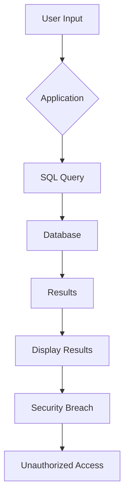

# Injection Flaws

# Injection Flaws: Understanding SQL, NoSQL, OS, and LDAP Injections

## Introduction

In today’s digital landscape, web applications are increasingly becoming targets for cyberattacks. One of the most common vulnerabilities that attackers exploit is known as injection flaws. These flaws occur when untrusted data is sent to an interpreter as part of a command or query. This blog post aims to provide a comprehensive understanding of different types of injection flaws, including SQL, NoSQL, OS, and LDAP injections, and how they can be mitigated.

## What Are Injection Flaws?

Injection flaws happen when an application sends untrusted data to an interpreter without proper validation or sanitization. This can lead to serious security breaches if the attacker manages to inject malicious code into the application. The OWASP Top 10 categorizes injection flaws under A03:2021-Injection, highlighting their significance in modern web security.

### Types of Injection Flaws

#### 1. SQL Injection

SQL injection occurs when an attacker inserts malicious SQL statements through input fields. If the application does not properly sanitize these inputs, the injected SQL commands can alter database queries, leading to unauthorized access, data theft, or even complete database takeover.

#### 2. NoSQL Injection

NoSQL databases, like MongoDB, are also susceptible to injection attacks. Similar to SQL injection, NoSQL injection involves injecting malicious code into queries that interact with the database. This can lead to unauthorized access to sensitive data stored in NoSQL databases.

#### 3. OS Command Injection

OS command injection happens when an attacker can execute arbitrary operating system commands on the server hosting the application. This type of attack can be particularly dangerous because it allows attackers to manipulate the underlying system, potentially leading to full system compromise.

#### 4. LDAP Injection

LDAP injection occurs when an attacker manipulates search strings used in Lightweight Directory Access Protocol (LDAP) queries. By injecting malicious code into these queries, attackers can bypass authentication mechanisms, leading to unauthorized access to directory services.

## How to Mitigate Injection Flaws

Preventing injection flaws requires a combination of secure coding practices and robust security measures:

- **Input Validation:** Always validate and sanitize all inputs before passing them to interpreters.
- **Use Prepared Statements:** For SQL queries, always use prepared statements with parameterized queries to prevent SQL injection.
- **Least Privilege Principle:** Ensure that database connections and other critical components operate with the least privileges necessary.
- **Regular Security Audits:** Conduct regular security audits and penetration testing to identify and fix potential vulnerabilities.

## Conclusion

Injection flaws represent a significant threat to web applications, but with the right precautions and best practices, they can be effectively managed. By understanding the different types of injection flaws and implementing robust security measures, developers can significantly reduce the risk of successful attacks. Stay vigilant and proactive in securing your applications against injection attacks.

---

This blog post provides a foundational understanding of injection flaws and offers practical advice on how to mitigate these vulnerabilities. Remember, security is an ongoing process, and continuous improvement is key to maintaining a secure environment.

## Demo & Implementation Ideas

주제인 "Injection Flaws"에 대한 블로그 포스트 초안을 읽어보았습니다. 이 글은 다양한 종류의 인젝션 공격에 대해 설명하고 있으며, 이를 방지하기 위한 방법들도 제시하고 있습니다. 독자들이 더 잘 이해할 수 있도록 다음과 같은 추가적인 내용을 제안합니다:

### 1. 실습 가능한 코드 스니펫 (Python)

#### SQL Injection 예방 코드
```python
import sqlite3

def safe_sql_query(user_input):
    conn = sqlite3.connect('example.db')
    cursor = conn.cursor()
    
    # 사용자가 입력한 값을 파라미터로 전달하여 SQL 인젝션을 방지합니다.
    cursor.execute("SELECT * FROM users WHERE username=?", (user_input,))
    
    print(cursor.fetchall())
    conn.close()

safe_sql_query('test_user')  # 안전한 호출
safe_sql_query('test_user OR 1=1 --')  # 위험한 호출 시도
```

위 코드는 파라미터화된 쿼리를 사용하여 SQL 인젝션을 방지하는 방법을 보여줍니다. `?`와 함께 튜플 `(user_input,)`을 전달함으로써 SQL 인젝션을 효과적으로 방지할 수 있습니다.

### 2. Mermaid 다이어그램 코드

다음과 같이 Mermaid 다이어그램 코드를 사용하여 SQL Injection 공격의 개념을 시각화할 수 있습니다:



이 그래프는 사용자의 입력이 애플리케이션을 통해 데이터베이스로 전송되는 과정을 보여줍니다. 만약 사용자의 입력이 적절히 검증되지 않으면, SQL 인젝션 공격을 통해 비정상적인 결과가 생성되고, 이는 보안 침해로 이어질 수 있습니다.

### 3. Docker Compose 설정

다음은 Docker Compose 파일의 예시입니다. 이 설정은 SQL Injection 공격을 테스트하기 위한 환경을 제공합니다:

```yaml
version: '3'
services:
  db:
    image: mysql:5.7
    environment:
      MYSQL_ROOT_PASSWORD: example
      MYSQL_DATABASE: test_db
    ports:
      - "3306:3306"
  app:
    build: .
    ports:
      - "8000:8000"
    depends_on:
      - db
```

위 설정은 MySQL 데이터베이스와 애플리케이션 서비스를 실행하는 Docker 컨테이너 환경을 만듭니다. 이렇게 하면 개발자는 실제 환경에서 SQL Injection 공격을 테스트하고, 이를 방지하기 위한 코드를 작성할 수 있습니다.

이러한 추가적인 내용들은 독자들이 이론적인 내용뿐만 아니라 실제 코드와 환경에서도 인젝션 공격을 이해하고 방지하는 방법을 배울 수 있도록 도와줄 것입니다.