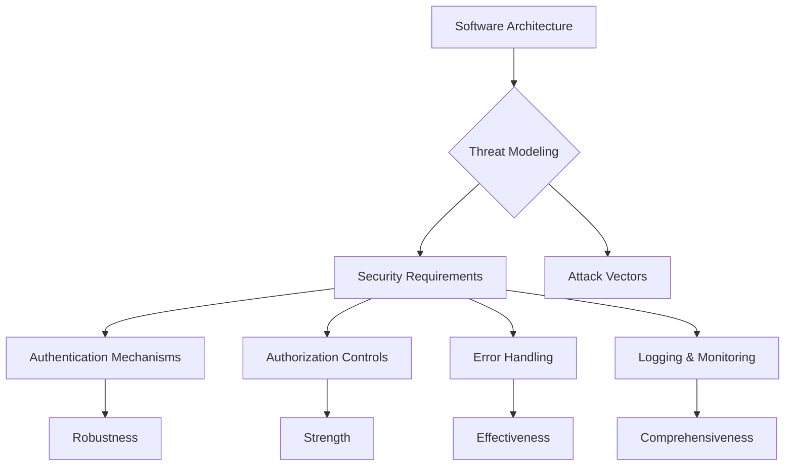

# Insecure Design

# Insecure Design: Why Secure Design Practices Are Crucial in 2021

## Introduction

In the ever-evolving landscape of cybersecurity, the year 2021 introduces a critical new category to the OWASP Top 10 list: **Insecure Design**. This category highlights the significant risks associated with design flaws and underscores the necessity of adopting secure design practices from the very beginning of any software development project. As we strive to move security further left in our development processes, understanding and addressing these design flaws becomes paramount.

## The Importance of Secure Design

### What Constitutes Insecure Design?

Insecure design refers to the inherent weaknesses present in the architecture and design of software systems. These flaws can manifest in various ways, including inadequate threat modeling, lack of proper security requirements, and insufficient consideration of potential attack vectors during the design phase. Such issues can lead to vulnerabilities that are difficult to fix once the software is deployed, making secure design practices essential.

### Common Examples of Insecure Design

- **Lack of Proper Authentication Mechanisms**: Failing to implement robust authentication mechanisms can leave systems vulnerable to unauthorized access.
- **Insufficient Authorization Controls**: Weak authorization controls can allow users to perform actions they should not be able to do.
- **Poor Error Handling**: Inadequate handling of errors can expose sensitive information about the system’s configuration and internal workings.
- **Ineffective Logging and Monitoring**: Without proper logging and monitoring, it becomes challenging to detect and respond to security incidents promptly.

### Why Is Secure Design Important?

Secure design is crucial because it lays the foundation for secure software. By addressing potential security issues early in the development process, teams can significantly reduce the risk of vulnerabilities being introduced into the final product. Moreover, secure design practices help ensure that the software is resilient against evolving threats and can adapt to changing security landscapes.

## Conclusion

Introducing the concept of Insecure Design into the OWASP Top 10 for 2021 marks a significant step towards prioritizing security in the design phase of software development. It emphasizes the need for comprehensive threat modeling, adherence to secure design patterns, and the adoption of well-defined reference architectures. By focusing on secure design, we can build more resilient and secure software systems, thereby protecting both our organizations and our customers from potential security breaches.

Moving forward, it is imperative for developers, architects, and security professionals alike to embrace secure design principles and integrate them into every stage of the software development lifecycle. Only through this proactive approach can we effectively mitigate the risks associated with insecure design and ensure the long-term security of our digital assets.

## Demo & Implementation Ideas

주제인 "Insecure Design"에 대한 블로그 포스트에서 독자가 더 잘 이해할 수 있도록 다음과 같은 추가 요소들을 제안합니다:

### 1. 실습 가능한 코드 스니펫 (Python)

#### 예시: 부적절한 오류 핸들링
부적절한 오류 핸들링은 시스템의 구성 정보와 내부 작동 방식을 노출시키는 위험을 초래할 수 있습니다. 아래는 Python에서 잘못 처리된 오류 핸들링 예시입니다.

```python
def divide(x, y):
    try:
        result = x / y
    except ZeroDivisionError as e:
        print(f"Error occurred: {e}")
        # 여기서 중요한 정보가 누출될 수 있음
        return None
    return result

print(divide(10, 0))
```

위 코드에서는 `ZeroDivisionError`가 발생했을 때, 오류 메시지가 출력되지만, 이 메시지는 시스템의 상태나 구조에 대한 중요한 정보를 포함하고 있을 수 있습니다. 이를 개선하기 위해선 오류 메시지를 최소화하거나, 사용자에게 보여지는 정보를 제한해야 합니다.

### 2. Mermaid 다이어그램 코드

Mermaid 다이어그램을 사용하여 Insecure Design의 개념을 시각적으로 표현할 수 있습니다. 예를 들어, 아래는 Insecure Design의 주요 구성 요소를 나타내는 Mermaid 다이어그램 코드입니다.



이 다이어그램은 Insecure Design의 주요 구성 요소를 보여줍니다. 각 구성 요소는 서로 연결되어 있으며, 이를 통해 시스템의 보안성을 강화하는 방법을 설명할 수 있습니다.

### 3. Docker Compose 설정

Docker Compose를 사용하여 실제 환경에서 Insecure Design의 문제점을 시연할 수 있습니다. 예를 들어, 아래는 Docker Compose 파일의 예시입니다.

```yaml
version: '3'
services:
  web:
    image: nginx:latest
    ports:
      - "8080:80"
    environment:
      - NGINX_ENVAR=public
    volumes:
      - ./nginx.conf:/etc/nginx/nginx.conf
```

위 설정은 기본적인 웹 서버 환경을 제공하며, `nginx.conf` 파일은 보안 취약점이 있는 설정을 포함할 수 있습니다. 이를 통해 독자는 실제 환경에서 Insecure Design의 문제점을 체험하고 이해할 수 있습니다.

이러한 추가 요소들은 독자가 Insecure Design의 중요성과 그 해결책을 더 잘 이해하도록 도울 것입니다.